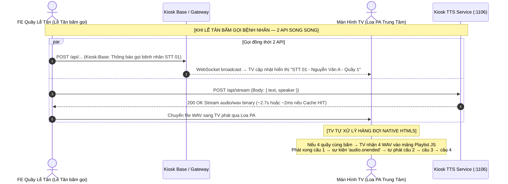

# Kiosk TTS Service (`kiosk-tts-service`)

Dịch vụ Chuyển văn bản thành giọng nói tiếng Việt (Vietnamese Text-to-Speech Streaming Microservice) chuyên dụng cho hệ thống Kiosk bệnh viện, đọc số thứ tự và gọi tên bệnh nhân.

---

## 📐 Sơ đồ kiến trúc sản xuất (Production Architecture Sequence Diagram)



---

## 📡 Danh sách API Endpoints Sản Xuất (Production API Specification)

### 🔹 1. Stream Audio API (POST - Ưu tiên sử dụng cho FE/TV)
* **Endpoint:** `POST /api/stream`
* **Mục đích:** Sinh âm thanh WAV trực tiếp từ câu thoại văn bản. Trả về luồng nhị phân `audio/wav` cực nhanh.
* **Request Body:**
```json
{
  "text": "Mời bệnh nhân Nguyễn Văn A vào quầy số 1",
  "speaker": "NF"
}
```
* **Response Headers:**
  * `Content-Type: audio/wav`
  * `X-Cache: HIT | MISS`
  * `X-Audio-Duration: 2.90`
  * `X-Process-Time: 2.20`

---

### 🔹 2. Stream Audio API (GET - Dùng cho thẻ HTML `<audio src="...">`)
* **Endpoint:** `GET /api/stream`
* **Query Parameters:**
  * `text`: Văn bản tiếng Việt cần phát âm (ví dụ: `Mời bệnh nhân Nguyễn Văn A vào quầy số 1`)
  * `speaker`: Giọng đọc (mặc định `NF`)
* **Ví dụ:**
```http
GET /api/stream?text=Mời bệnh nhân Nguyễn Văn A vào quầy số 1&speaker=NF
```

---

### 🔹 3. Danh sách giọng đọc (Speakers)
* **Endpoint:** `GET /api/speakers`
* **Response (Standard Wrapper):**
```json
{
  "success": true,
  "message": "Danh sách giọng đọc sẵn có",
  "data": {
    "defaultSpeaker": "NF",
    "availableSpeakers": ["NF", "SF", "NM1", "SM", "NM2"]
  }
}
```

---

### 🔹 4. Kubernetes Health Probes & Swagger Docs

* **Swagger UI Interactive Docs:** `http://localhost:1106/api-docs` (Có sẵn HTML5 Audio Player ▶️ nghe trực tiếp)
* **Liveness Probe:** `GET /api/health`
* **Readiness Probe:** `GET /api/health/ready`

---

## 🎙️ Danh sách 5 giọng đọc (Speaker IDs)

| Speaker ID | Tên giọng đọc | Mô tả |
| :--- | :--- | :--- |
| **`NF`** | Nữ miền Bắc | Giọng nữ Hà Nội chuẩn (Default cho Kiosk Bệnh viện) |
| **`SF`** | Nữ miền Nam | Giọng nữ Sài Gòn truyền cảm |
| **`NM1`** | Nam miền Bắc 1 | Giọng nam Hà Nội trầm ấm (Giọng 1) |
| **`NM2`** | Nam miền Bắc 2 | Giọng nam Hà Nội rõ ràng (Giọng 2) |
| **`SM`** | Nam miền Nam | Giọng nam Sài Gòn tự nhiên |

---

## ⚙️ Biến môi trường (Environment Variables)

| Variable | Default | Mô tả |
| :--- | :--- | :--- |
| `HOST` | `0.0.0.0` | Listen IP |
| `PORT` | `1106` | Port chạy microservice |
| `DEVICE` | `cpu` | Thiết bị tính toán (`cpu` hoặc `cuda`) |
| `DEFAULT_SPEAKER` | `NF` | Giọng đọc mặc định |
| `DEFAULT_SPEED` | `0.88` | Tốc độ đọc (0.88x = chậm rãi dễ nghe cho người già) |
| `REDIS_HOST` | `redis.infrastructure.svc.cluster.local` | Hostname Redis Infrastructure trong K3s |
| `REDIS_PORT` | `6379` | Port Redis |
| `REDIS_TTL` | `300` | Thời gian lưu audio cache (5 phút) |
| `CACHE_ENABLED` | `true` | Bật/tắt Redis Audio Cache |