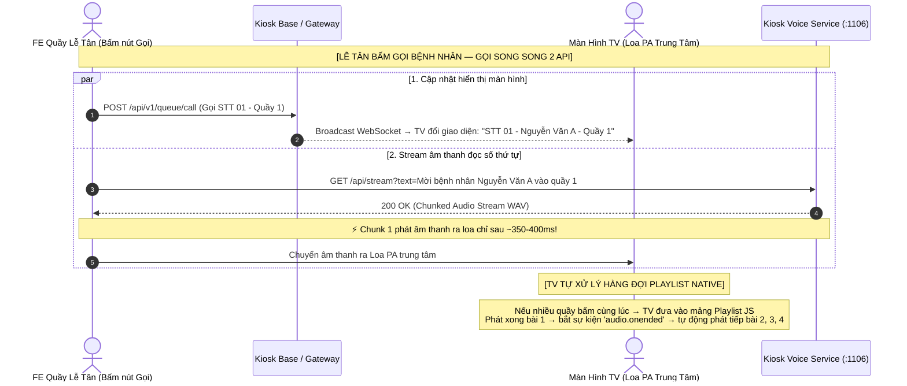

# Kiosk Voice Microservice (`kiosk-voice`)

Microservice tổng hợp giọng nói tiếng Việt tốc độ cao (High-Performance Vietnamese TTS Audio Streaming) chuyên dụng cho hệ thống Kiosk Bệnh viện: đọc số thứ tự, gọi tên bệnh nhân và hướng dẫn vào phòng khám.

---

## 📐 Sơ đồ luồng hoạt động (Sequence Diagram)

Khi **Lễ tân bấm nút gọi bệnh nhân**, Frontend gọi song song 2 API độc lập:



---

## 📡 Danh sách API Specifications

### 🔹 1. Stream Audio API (GET — Khuyên dùng cho thẻ HTML5 `<audio>`)
* **Endpoint:** `GET /api/stream`
* **Ý nghĩa:** Trả về luồng âm thanh WAV nhị phân (`audio/wav`) phát trực tiếp ra loa. Áp dụng kỹ thuật **Chunk Streaming** giúp phát tiếng chỉ sau **~350-400ms**.
* **Query Parameters:**
  * `text` *(String, Bắt buộc)*: Văn bản tiếng Việt cần đọc (Ví dụ: `Mời bệnh nhân Nguyễn Văn A vào quầy số 1`).
  * `speaker` *(String, Tùy chọn)*: Mã giọng đọc (`NF`, `SF`, `NM1`, `NM2`, `SM`). Mặc định: `NF`.

* **Ví dụ gọi trực tiếp trên Frontend:**
```javascript
// Phát âm thanh ra loa lập tức với trễ perceived ~350-400ms!
const audioUrl = "https://kioskvoice.bvdk333.work/api/stream?text=" + encodeURIComponent("Mời bệnh nhân Nguyễn Văn A vào quầy số 1");
new Audio(audioUrl).play();
```

* **Response Headers:**
  * `Content-Type: audio/wav`
  * `X-Cache: HIT | MISS`
  * `X-Streaming: chunked`

---

### 🔹 2. Stream Audio API (POST — Dùng khi gửi JSON Body)
* **Endpoint:** `POST /api/stream`
* **Ý nghĩa:** Tương tự `GET /api/stream`, dùng khi truyền dữ liệu qua JSON Body.
* **Request Body:**
```json
{
  "text": "Mời bệnh nhân Nguyễn Văn A vào quầy số 1",
  "speaker": "NF"
}
```
* **Response:** Stream Binary `audio/wav`.

---

### 🔹 3. Danh sách giọng đọc (Speakers List)
* **Endpoint:** `GET /api/speakers`
* **Ý nghĩa:** Lấy danh sách các mã giọng đọc (speaker IDs) đang sẵn có trên hệ thống.
* **Response Body (Standard Wrapper Format):**
```json
{
  "success": true,
  "message": "Danh sách giọng đọc sẵn có",
  "data": {
    "defaultSpeaker": "NF",
    "availableSpeakers": [
      "NF",
      "SF",
      "NM1",
      "SM",
      "NM2"
    ]
  }
}
```

---

### 🔹 4. System Health Check & Probes (Kubernetes)
* **Swagger UI:** `https://kioskvoice.bvdk333.work/api-docs` *(Có sẵn trình phát Audio HTML5 để test trực tiếp)*
* **Liveness Probe:** `GET /api/health`
* **Readiness Probe:** `GET /api/health/ready`

---

## 🎙️ Danh sách 5 Giọng Đọc (Speaker IDs)

| Speaker ID | Tên Giọng | Vùng Miền | Giới Tính | Mô Tả |
| :--- | :--- | :--- | :--- | :--- |
| **`NF`** | Nữ miền Bắc | Miền Bắc | Nữ | Giọng Hà Nội chuẩn (Mặc định cho Kiosk Bệnh viện) |
| **`SF`** | Nữ miền Nam | Miền Nam | Nữ | Giọng Sài Gòn truyền cảm, dễ nghe |
| **`NM1`** | Nam miền Bắc 1 | Miền Bắc | Nam | Giọng Nam Hà Nội trầm ấm (Giọng 1) |
| **`NM2`** | Nam miền Bắc 2 | Miền Bắc | Nam | Giọng Nam Hà Nội rõ ràng (Giọng 2) |
| **`SM`** | Nam miền Nam | Miền Nam | Nam | Giọng Nam Sài Gòn tự nhiên |

---

## 📋 Chuẩn định dạng Response (API Standard)

Tất cả các API JSON của hệ thống tuân thủ theo chuẩn cấu trúc duy nhất:

```json
{
  "success": true,
  "message": "Thông điệp phản hồi",
  "data": { ... }
}
```
*(Các API `/api/stream` trả về trực tiếp luồng nhị phân `audio/wav`).*